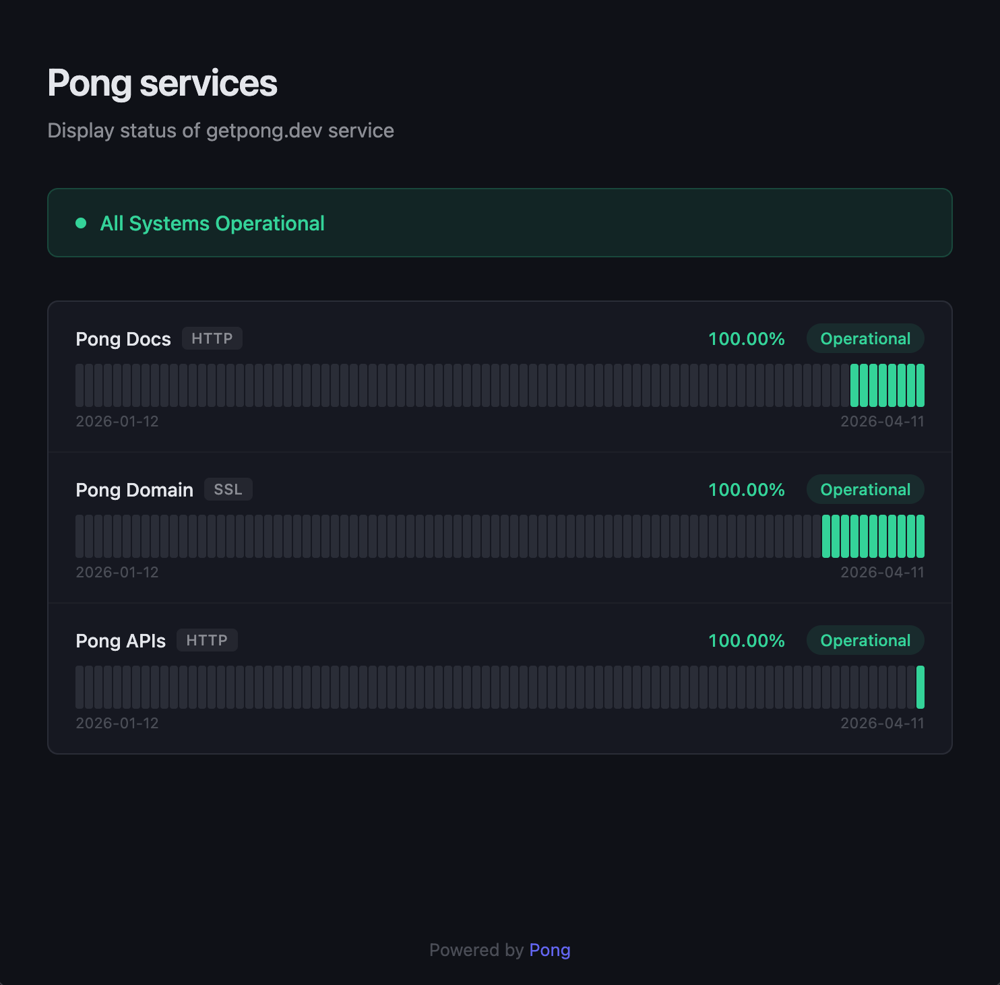

# Pong

Uptime monitoring with a real API. Monitor HTTP endpoints, TCP ports, SSL certificates, and background services. Get alerts via webhook, Slack, or email. Self-host with a single Docker command.

## Quick Start

```bash
docker run -e ADMIN_API_KEY=pong_mykey -p 8080:8080 ghcr.io/getpong/pong-backend-go
```

That's it. Open `http://localhost:8080/healthz` to verify.

## Features

- **HTTP monitoring** — status code checks, keyword/regex matching, optional Basic Auth or custom header authentication
- **TCP/UDP port monitoring** — check if databases, Redis, DNS servers, game servers are accepting connections
- **SSL certificate monitoring** — alert before certificates expire
- **Heartbeat monitoring** — your services ping Pong; alert if they stop
- **Alerts** — webhook, Slack, email. Fire on state transitions only (no spam)
- **Public status pages** — shareable URLs with 90-day uptime timeline, optional password
- **Full REST API** — every feature is API-accessible, OpenAPI spec included
- **API keys** — `pong_` prefixed keys for scripts and CI/CD
- **Confirmation count** — N consecutive failures before alerting
- **Data pruning** — automatic cleanup of old check results

## Monitor Types

| Type | What it checks |
|------|---------------|
| `http` | HTTP/HTTPS endpoint, status code, optional keyword/regex |
| `port` | TCP or UDP connection to host:port |
| `ssl` | TLS certificate expiry date |
| `heartbeat` | Expects periodic pings, alerts if they stop |


## Status pages
Status pages are rendered directely via template files, here's and example.


## API Usage

```bash
# Create a monitor
curl -X POST http://localhost:8080/api/v1/monitors \
  -H "Authorization: Bearer pong_mykey" \
  -H "Content-Type: application/json" \
  -d '{"name":"My API","type":"http","target":"https://api.example.com/health"}'

# Check uptime
curl http://localhost:8080/api/v1/monitors/1/uptime \
  -H "Authorization: Bearer pong_mykey"

# Heartbeat ping (public, no auth)
curl http://localhost:8080/api/v1/heartbeat/YOUR_TOKEN
```

Full API documentation: [docs.getpong.dev](https://docs.getpong.dev)

## Self-Hosting

### Docker

```bash
docker run -d \
  -e ADMIN_API_KEY=pong_mykey \
  -p 8080:8080 \
  -v pong-data:/app/data \
  ghcr.io/getpong/pong-backend-go
```

### Docker Compose

```yaml
services:
  pong:
    image: ghcr.io/getpong/pong-backend-go
    ports:
      - "8080:8080"
    volumes:
      - pong-data:/app/data
    environment:
      - ADMIN_API_KEY=pong_mykey
    restart: unless-stopped

volumes:
  pong-data:
```

### Build from Source

```bash
git clone https://github.com/getpong/pong-backend-go.git
cd pong-backend-go
go build -o pong ./cmd/server
ADMIN_API_KEY=pong_mykey ./pong
```

## Configuration

| Variable | Default | Description |
|----------|---------|-------------|
| `ADMIN_API_KEY` | — | Bootstrap admin API key (enables API-key-only mode) |
| `AUTH0_DOMAIN` | — | Auth0 tenant domain (for hosted service) |
| `AUTH0_AUDIENCE` | — | Auth0 API identifier |
| `BASE_URL` | `http://localhost:8080` | Public URL for email verification links |
| `PORT` | `8080` | HTTP server port |
| `DATABASE_PATH` | `data/ghm.db` | SQLite database path |
| `WORKER_COUNT` | `20` | Concurrent check workers |
| `CHECK_TICK_SECONDS` | `1` | Scheduler tick interval |
| `RETENTION_DAYS` | `90` | Days to keep check results and alert logs |
| `SMTP_HOST` | — | SMTP server for email alerts |
| `SMTP_PORT` | — | SMTP port (typically 587) |
| `SMTP_USER` | — | SMTP username |
| `SMTP_PASS` | — | SMTP password |
| `SMTP_FROM` | — | Sender address for alerts |
| `SMTP_FROM_NOREPLY` | — | Sender for verification emails |
| `ENFORCE_PLAN_LIMITS` | `false` | Enable plan-based resource limits |
| `REQUIRE_EMAIL_VERIFICATION` | `false` | Require email contacts to verify before receiving alerts |
| `ENCRYPTION_KEY` | — | 64-char hex key for encrypting monitor credentials (required for HTTP auth) |

Either `ADMIN_API_KEY` or `AUTH0_DOMAIN` must be set.

Generate an encryption key with `openssl rand -hex 32`.

## Architecture

Single Go binary, SQLite (WAL mode), no external dependencies.

```
Scheduler (1s tick)
  - query due monitors
  - dispatch to worker pool (20 goroutines)
  - workers run checks (HTTP/SSL/port/heartbeat)
  - write results to SQLite
  - on state change -> alert via webhook/Slack/email
```

## Hosted Service

Don't want to self-host? Use the hosted version at [getpong.dev](https://www.getpong.dev) — free tier includes 25 monitors.

## License

[MIT](LICENSE)
